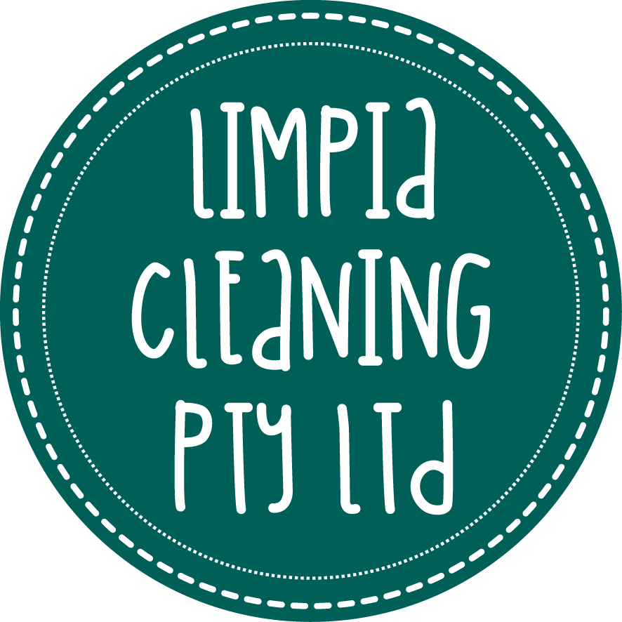

<p align="center">
  
</p>

<h1 align="center">Limpia Cleaning — Panel de Gestión</h1>

<p align="center">
  Sistema interno de administración para <strong>Limpia Cleaning</strong>.<br/>
  Gestión de sitios, equipos, reportes, inventario, vehículos y más — todo desde una sola interfaz.
</p>

<p align="center">
  
  
  
  
  
</p>

---

## Descripción

Aplicación SPA construida con **React 19 + Vite 7** que sirve como panel de control interno para la empresa de limpieza **Limpia Cleaning**. Permite a administradores, gerentes, contadores y personal de limpieza gestionar todas las operaciones del día a día.

## Módulos

| Módulo | Descripción |
|---|---|
| **Dashboard** | Vista general con métricas clave |
| **Usuarios** | Alta, edición y gestión de usuarios del sistema |
| **Equipos** | Organización del personal en equipos de trabajo |
| **Clientes** | Gestión de la cartera de clientes |
| **Sitios** | Administración de ubicaciones con mapas interactivos (Mapbox) |
| **Bitácoras (Logs)** | Registro diario de actividades por sitio |
| **Reportes** | Generación y consulta de reportes de servicio |
| **Inventario** | Control de suministros y herramientas |
| **Pedidos** | Solicitud y seguimiento de órdenes de suministros |
| **Vehículos** | Registro de vehículos y servicios mecánicos |
| **Vacaciones** | Solicitudes y aprobación de vacaciones |
| **Quejas** | Seguimiento de quejas y reclamaciones |
| **Planner** | Planificación semanal de actividades |
| **Reporte de Tiempo** | Control de horas trabajadas por el personal |

## Roles del Sistema

| Rol | Acceso |
|---|---|
| `admin` | Acceso completo a todos los módulos |
| `manager` | Gestión operativa — equipos, sitios, usuarios, inventario |
| `accountant` | Reportes, pedidos y clientes |
| `cleaner` | Mis sitios, bitácoras, mis pedidos, mis vacaciones |

## Tech Stack

- **UI Framework:** React 19 + MUI v7 (Material UI)
- **Bundler:** Vite 7 con HMR
- **Routing:** React Router DOM v7 con rutas protegidas por rol
- **HTTP Client:** Axios con interceptores JWT
- **Mapas:** Mapbox GL JS
- **Tema:** Light / Dark mode con color primario `#26614f`
- **Fuente:** Montserrat

## Estructura del Proyecto

```
src/
├── assets/             # Imágenes y recursos estáticos
├── components/
│   ├── layout/         # MainLayout, Sidebar, Topbar
│   └── ui/             # Componentes reutilizables (DataTable, FormModal, etc.)
├── context/            # AuthContext, ThemeContext
├── pages/              # Módulos organizados por dominio
│   ├── auth/
│   ├── dashboard/
│   ├── users/
│   ├── teams/
│   ├── clients/
│   ├── sites/
│   ├── logs/
│   ├── reports/
│   ├── supplies/
│   ├── orders/
│   ├── tools/
│   ├── cars/
│   ├── vacations/
│   ├── complaints/
│   ├── planner/
│   └── time-report/
├── routes/             # AppRouter + ProtectedRoute
├── services/           # Capa de servicios API (*.service.js)
└── theme/              # Configuración del tema MUI
```

## Instalación

```bash
# Clonar el repositorio
git clone <repo-url>
cd frontend

# Instalar dependencias
npm install

# Configurar variables de entorno
cp .env.development.example .env.development
# Editar VITE_API_URL con la URL del backend

# Iniciar en modo desarrollo
npm run dev
```

## Scripts

| Comando | Descripción |
|---|---|
| `npm run dev` | Servidor de desarrollo con HMR |
| `npm run build` | Build de producción → `dist/` |
| `npm run preview` | Preview del build de producción |
| `npm run lint` | Ejecutar ESLint |

---

<p align="center">
  Desarrollado para <strong>Limpia Cleaning</strong>
</p>
